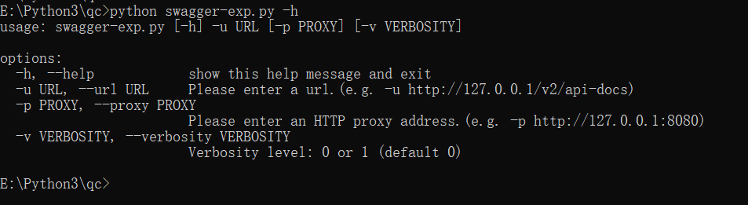
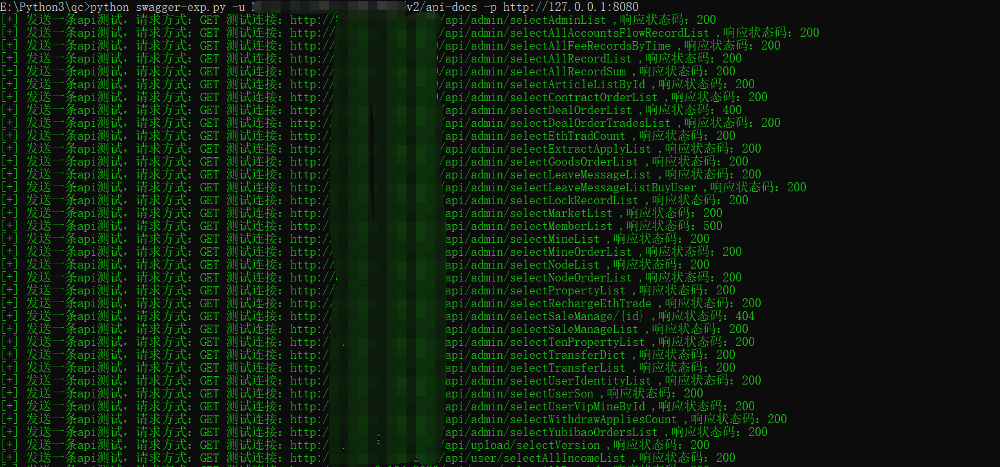
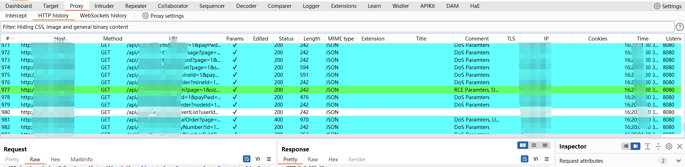
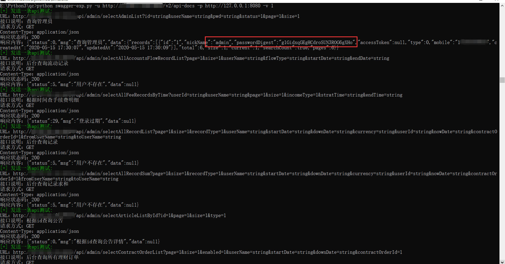

# swagger接口测试小脚本

根据惯例呢，这里依然说一下，为啥写这个，平时看到swagger接口就会测测swagger接口有没有敏感数据泄露、未授权访问、或者sql注入之类的。但是那么多接口我看着就头大，于是就找了几个工具，主要是swagger-hack和swagger-exp，那说到这里，继续按照惯例推荐几个工具。

一个是swagger-hack：https://github.com/jayus0821/swagger-hack

另一个是swagger-exp：https://github.com/lijiejie/swagger-exp

辅助工具：swagger-editor：https://github.com/swagger-api/swagger-editor

但是呢，这两个工具我都不太敢用，是因为在测试swagger接口，有大量的接口其实都是增加、删除、修改接口，说实话谁敢测呀，比如删除用户的接口，要求传一个uid，你传一个uid=1过去，真把人家用户删了，那就真的很尬。**所以对于swagger接口的测试要谨慎！**

而且，我是想脚本可以走代理让xray啥的帮我测接口里的sql注入之类的，要手动测也可以那种。所以就自己写了一个垃圾脚本，我这个脚本呢目前只支持/v2/api-docs的接口测试，不支持swagger-ui.html，说白了就是个垃圾，这样理解就对了。

再说一遍**只支持/v2/api-docs不支持swagger-ui.html**

# 工具的使用

三个参数。

```
-u # 指定URL
-p # 指定代理，一般配合burp和xray使用。
-v # 指定是否打印详细信息，可以指定0或者1，默认是0。
```



一般怎么用好呢？

```
python swagger-exp.py -u http://xxx.xxx.xxx.xxx/v2/api-docs -p http://127.0.0.1:8080
```

就是这样用，这样代理转到burp以后呢，burp联动xray，当然你也可以直接给xray，但是这里我是推荐先给burp的，然后再给xray。

以为burp你可以使用HaE工具，这样做如果接口返回有敏感信息，就可以看到颜色高亮，方便一些。工具地址https://github.com/gh0stkey/HaE






当然啦，如果你想再脚本中直接显示更详细的信息你就加个-v参数。

```
python swagger-exp.py -u http://xxx.xxx.xxx.xxx/v2/api-docs -p http://127.0.0.1:8080 -v 1
```

