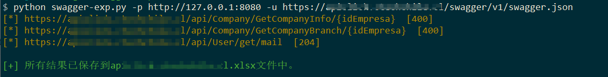
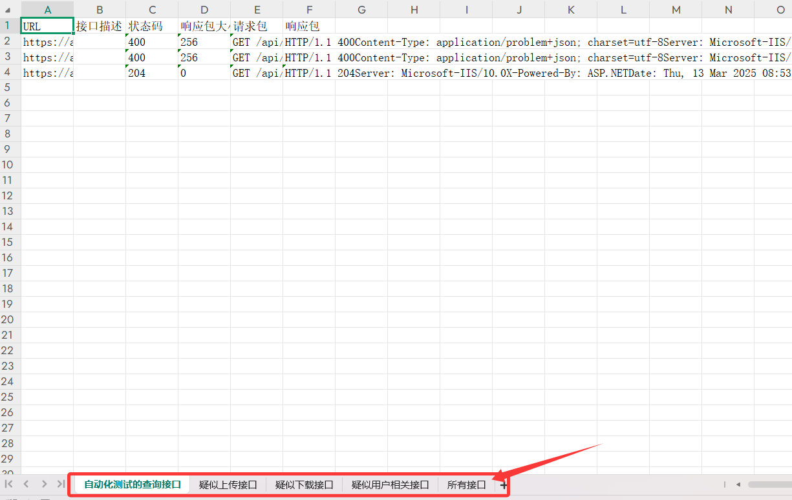

# swagger接口测试小脚本

平时看到swagger接口就会测测swagger接口有没有敏感数据泄露、未授权访问、或者sql注入之类的。但是在测试swagger接口，有大量的接口其实都是增加、删除、修改接口，说实话谁敢测呀，比如删除用户的接口，要求传一个uid，你传一个uid=1过去，真把人家用户删了，那就真的很尬。**所以对于swagger接口的测试要谨慎！**，该脚本默认对api通过判断api接口名字是否包含get、select、search、query来判断是否是查询接口，只对查询接口做了测试。

**如果要测所有的接口那么请使用`-m all`参数，生产环境不建议使用**。

而且，我是想脚本可以走代理让xray啥的帮我测接口里的sql注入之类的，要手动测也可以那种。所以就自己写了一个垃圾脚本，**不支持swagger-ui.html，看到swagger-ui.html，找一下api的json数据就可以用这个工具了。**

**工具的优势：**

2. 简单，依赖库少，只依赖requests库、openpyxl库和colorama库，不需要调用浏览器解析而产生一些浏览器相关的错误。
3. 识别显示上传接口、下载接口和用户接口，告诉使用者，哪些接口可能是上传接口和下载接口，方便使用者自己构造测试。
4. 执行一次不带参数请求，因为带有参数都是垃圾参数，为了避免带有垃圾参数差不到数据，而不带参数请求能获取到未授权数据的情况。
4. 把所有接口分类保存到xlsx文档，没有自动测试的非查询接口可以到xlsx中查看，然后自己手动测试。

# 工具的使用

使用前，使用以下命令安装依赖库。

```
pip install -r requirements.txt https://pypi.tuna.tsinghua.edu.cn/simple/ --trusted-host pypi.tuna.tsinghua.edu.cn
```

**正确食用方法：脚本+burp+HaE插件+Xray**

用法：

```
usage: swagger-exp.py [-h] -u URL [-p PROXY] [-path PATH] [-cookie COOKIE] [-m MODE]

options:
  -h, --help            show this help message and exit
  -u URL, --url URL     指定测试的URL(e.g. -u http://127.0.0.1/v2/api-docs)
  -p PROXY, --proxy PROXY
                        设置代理(e.g. -p http://127.0.0.1:8080)
  -path PATH, --path PATH
                        指定路径，默认api是根路径拼接，如http://xxx.xx/user/api，但是实际路径可能是http://xxx.xx/admin/user/api，那么这个admin就需要该参数
                        来指定。
  -cookie COOKIE, --cookie COOKIE
                        指定cookie
  -m MODE, --mode MODE  指定模式，默认是sec（只测试查询接口），也可以指定为all测试所有接口。
```

一般怎么用好呢？

```
python swagger-exp.py -u http://xxx.xxx.xxx.xxx/v2/api-docs -p http://127.0.0.1:8080
```



执行结束后会把所有的结果分类保存到xlsx文件中。



最好结合burp进行使用，如果想再继续挂xray测试也行，因为默认测试的是查询接口，一般不会对系统进行增删改操作。

burp你可以使用HaE等类似工具，这样做如果接口返回有敏感信息，就可以看到颜色高亮，方便一些。工具地址：https://github.com/gh0stkey/HaE

同时，如果你需要手动测试，可以把你想测试的请求再burp的HTTP history中发送到Repeater进行手动测试。


另外，因为脚本是自动拿出参数来，然后参数值是随便填的，就会导致有可能带有参数的时候没啥数据，而不带参数反而有数据。

针对这种情况，脚本在请求带参请求之前会做一次不带参请求，但是只有代理的burp中才能看得到数据，xlsx文件中不记录，**因此非常建议大家用该脚本的时候结合burp使用，最好再结合使用HaE等类似插件。**


