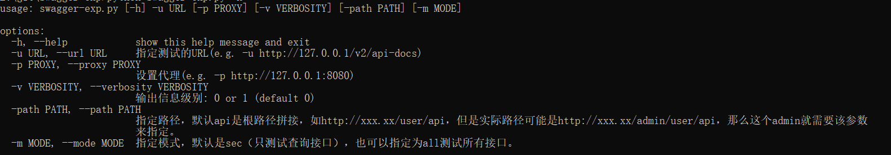
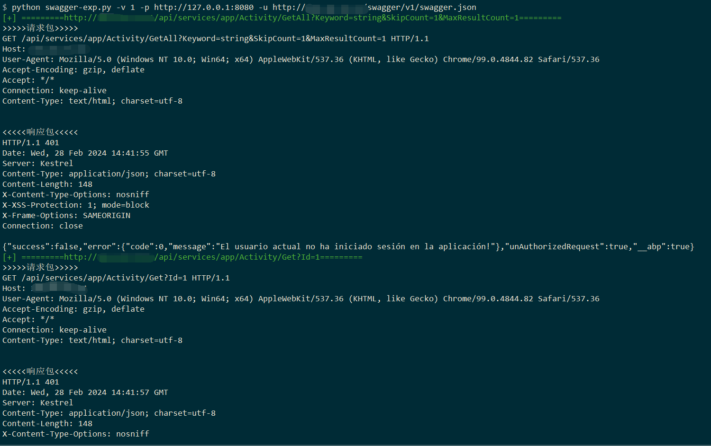
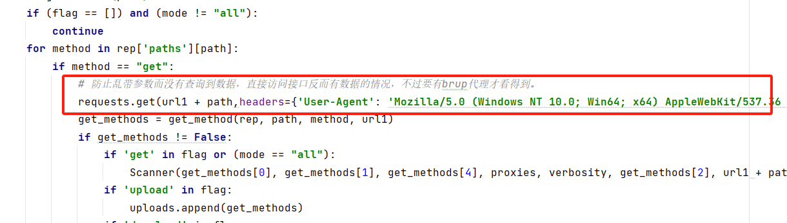
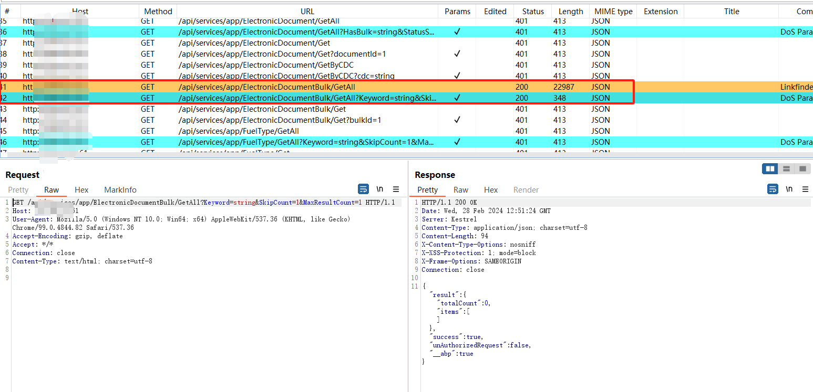

# swagger接口测试小脚本

根据惯例呢，这里依然说一下，为啥写这个，平时看到swagger接口就会测测swagger接口有没有敏感数据泄露、未授权访问、或者sql注入之类的。但是那么多接口我看着就头大，于是就找了几个工具，主要是swagger-hack和swagger-exp，那说到这里，继续按照惯例推荐几个工具。

一个是swagger-hack：https://github.com/jayus0821/swagger-hack

另一个是swagger-exp：https://github.com/lijiejie/swagger-exp

辅助工具：swagger-editor：https://github.com/swagger-api/swagger-editor

但是呢，这两个工具我都不太敢用，是因为在测试swagger接口，有大量的接口其实都是增加、删除、修改接口，说实话谁敢测呀，比如删除用户的接口，要求传一个uid，你传一个uid=1过去，真把人家用户删了，那就真的很尬。**所以对于swagger接口的测试要谨慎！**，该脚本默认对api通过判断api接口名字是否包含get、select、search、query来判断是否是查询接口，只对查询接口做了测试。

**如果要测所有的接口那么请使用`-m all`参数，生产环境不建议使用**。

而且，我是想脚本可以走代理让xray啥的帮我测接口里的sql注入之类的，要手动测也可以那种。所以就自己写了一个垃圾脚本，不支持swagger-ui.html，看到swagger-ui.html，找一下api的json数据就可以用这个工具了。

再说一遍**只支持/v2/api-docs这种json格式的，不支持swagger-ui.html这种html格式**

**工具的优势：**
1. 识别构造测试查询接口。
2. 简单，依赖库少，只依赖requests库和colorama库，不需要像https://github.com/lijiejie/swagger-exp 工具一样调用浏览器，会报一些浏览器相关的错误。
3. 识别显示上传接口和下载接口，告诉使用者，哪些接口可能是上传接口和下载接口，方便使用者自己构造测试。
4. 执行一次不带参数请求，因为带有参数都是垃圾参数，为了避免带有垃圾参数差不到数据，而不带参数请求能获取到未授权数据的情况。

# 工具的使用

**正确食用方法：脚本+burp+HaE插件+Xray**

用法：

```
usage: swagger-exp.py [-h] -u URL [-p PROXY] [-v VERBOSITY] [-path PATH] [-m MODE]

options:
  -h, --help            show this help message and exit
  -u URL, --url URL     指定测试的URL(e.g. -u http://127.0.0.1/v2/api-docs)
  -p PROXY, --proxy PROXY
                        设置代理(e.g. -p http://127.0.0.1:8080)
  -v VERBOSITY, --verbosity VERBOSITY
                        输出信息级别: 0 or 1 (default 0)
  -path PATH, --path PATH
                        指定路径，默认api是根路径拼接，如http://xxx.xx/user/api，但是实际路径可能是http://xxx.xx/admin/user/api，那么这个admin就需要该参数来指定。
  -m MODE, --mode MODE  指定模式，默认是sec（只测试查询接口），也可以指定为all测试所有接口。
```



一般怎么用好呢？

```
python swagger-exp.py -u http://xxx.xxx.xxx.xxx/v2/api-docs -p http://127.0.0.1:8080
```

就是这样用，这样代理转到burp以后呢，burp联动xray，当然你也可以直接给xray，但是这里我是推荐先给burp的，然后再给xray。

以为burp你可以使用HaE工具，这样做如果接口返回有敏感信息，就可以看到颜色高亮，方便一些。工具地址https://github.com/gh0stkey/HaE

同时呢，如果你需要手动测试，可以把你想测试的请求再burp的HTTP history中发送到Repeater进行手动测试。


当然啦，如果你想再脚本中直接显示更详细的信息你就加个-v参数。

```
python swagger-exp.py -u http://xxx.xxx.xxx.xxx/v2/api-docs -p http://127.0.0.1:8080 -v 1
```



还有一种情况，因为脚本是自动拿出参数来，然后参数值是随便填的，就会导致有可能带有参数的时候没啥数据，而不带参数反而有数据。

针对这种情况，脚本在请求带参请求之前会做一次不带参请求，但是这个请求`-v 1`参数是不显示，只有代理的burp中才能看得到数据历史，因此非常建议大家用该脚本的时候配合burp+HaE插件+xray使用。





